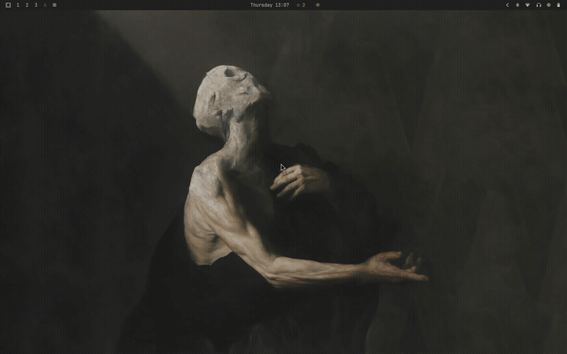
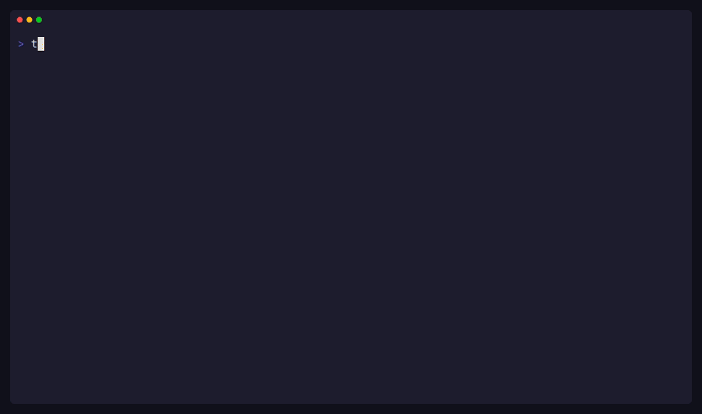
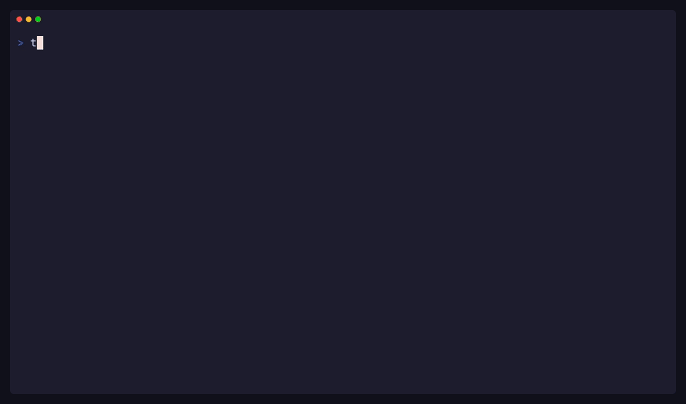

# Tasuki

Tasuki (タスキ) — a Japanese sash used to secure long sleeves, enabling ease of movement for daily work.

A TUI task manager that lives in your [Waybar](https://github.com/Alexays/Waybar/). Pull tasks from multiple sources into one view. Single Rust binary. Compatible with [Omarchy](https://github.com/basecamp/omarchy).

- Aggregate tasks from local files and [Obsidian](https://publish.obsidian.md/tasks/Introduction) vaults
- Smart Waybar badge and tooltip — task count at a glance, TUI a click away
- Quick-add with natural language — priorities, due dates, tags, backend routing
- Live config reload — toggle backends, switch themes, no restart needed
- Dark, light, and dynamic [Omarchy](https://github.com/basecamp/omarchy) theme support

---

### TUI


Navigate, quick-add, edit, and complete tasks without leaving the terminal. Tasks from all backends sorted by urgency.

### Waybar



Smart badge shows the most urgent count. Tooltip groups tasks by date with source icons.

### Backend aggregation



Toggle backends on and off in the config — tasks appear and disappear live.

### Live theme switching



Themes reload instantly when config changes.

---

## Install

```bash
curl -fsSL https://github.com/zachfleeman/tasuki/raw/main/install.sh | bash
```

Installs a prebuilt binary to `~/.local/bin/`.

Or build from source:

```bash
git clone https://github.com/zachfleeman/tasuki.git
cargo install --path tasuki
```

Installs to `~/.cargo/bin/`.

## Quick Start

```bash
mkdir -p ~/.config/tasuki
curl -fsSL https://github.com/zachfleeman/tasuki/raw/main/config.example.toml \
  -o ~/.config/tasuki/config.toml
tasuki add "Review PR today (p1)"
tasuki add "Buy groceries tomorrow #errands"
tasuki tui
```

## Backends

**Local file** — reads/writes `~/.tasuki/todo.txt` by default.

**Obsidian** — scans your vault for markdown checkboxes. Supports [Obsidian Tasks](https://publish.obsidian.md/tasks/Introduction) emoji metadata. Changes in the vault auto-refresh the TUI. Press `o` to open a task in Obsidian or `$EDITOR`.

```toml
[backends.obsidian]
enabled = true
vault_path = "~/Documents/Obsidian"
ignore_folders = [".obsidian", ".trash"]
inbox_file = "Inbox.md"
```

## Waybar

Add this module to `~/.config/waybar/config.jsonc` under the `modules-left`, `modules-center`, or `modules-right` config:

```jsonc
"custom/tasks": {
    "exec": "tasuki",
    "return-type": "json",
    "format": "{}",
    "on-click": "<your-terminal> -e tasuki tui",
    "interval": 30,
    "tooltip": true
}
```

If the module disappears on Waybar reload, use absolute paths (e.g., `/home/<USER>/.local/bin/tasuki`). Waybar may not inherit your `$PATH`.

## Configuration

`~/.config/tasuki/config.toml` — changes are hot-reloaded. Press `c` in the TUI to edit. See [`config.example.toml`](config.example.toml) for all options.

## TUI Keybindings

| Key | Action |
|-----|--------|
| `↑`/`↓` or `j`/`k` | Navigate |
| `a` | Quick-add task |
| `e` | Edit task |
| `x` or `Enter` | Toggle complete |
| `d` | Delete task |
| `o` | Open in source app / `$EDITOR` |
| `/` | Search |
| `Tab` / `S-Tab` | Jump between groups |
| `Space` | Collapse / expand group |
| `c` | Open config in `$EDITOR` |
| `?` | Help |
| `q` | Quit |

## License

MIT
